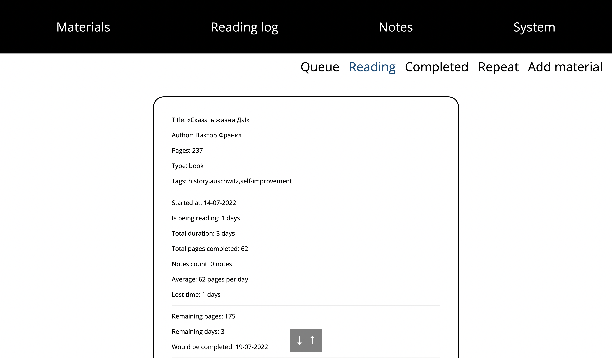
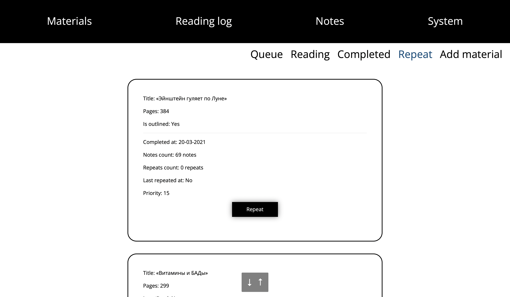
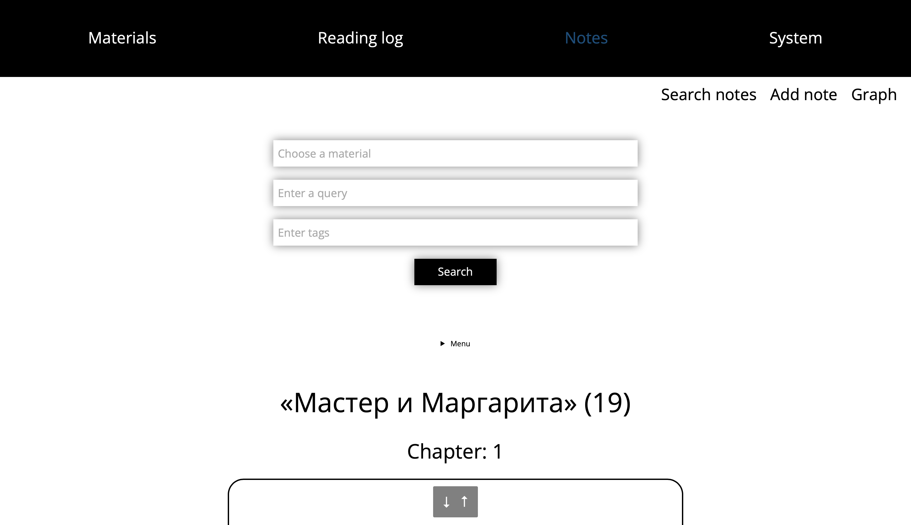
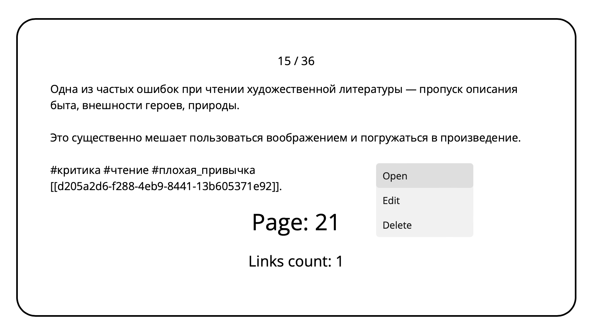
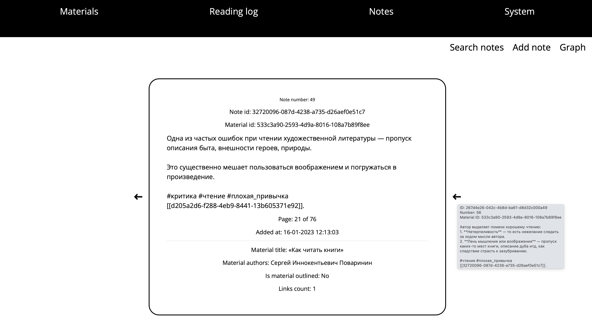
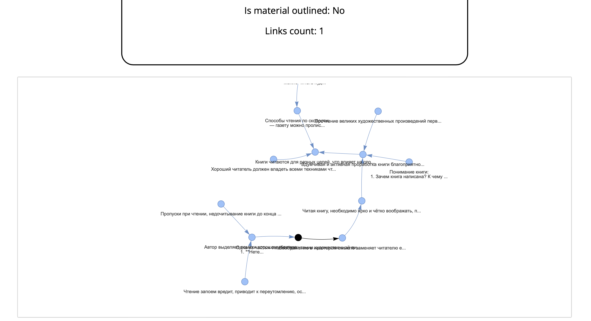
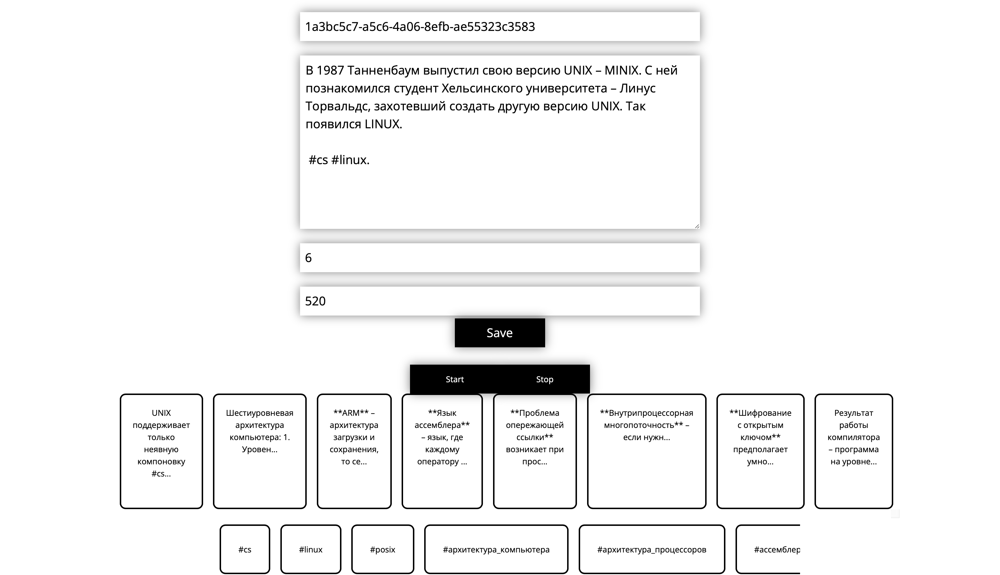
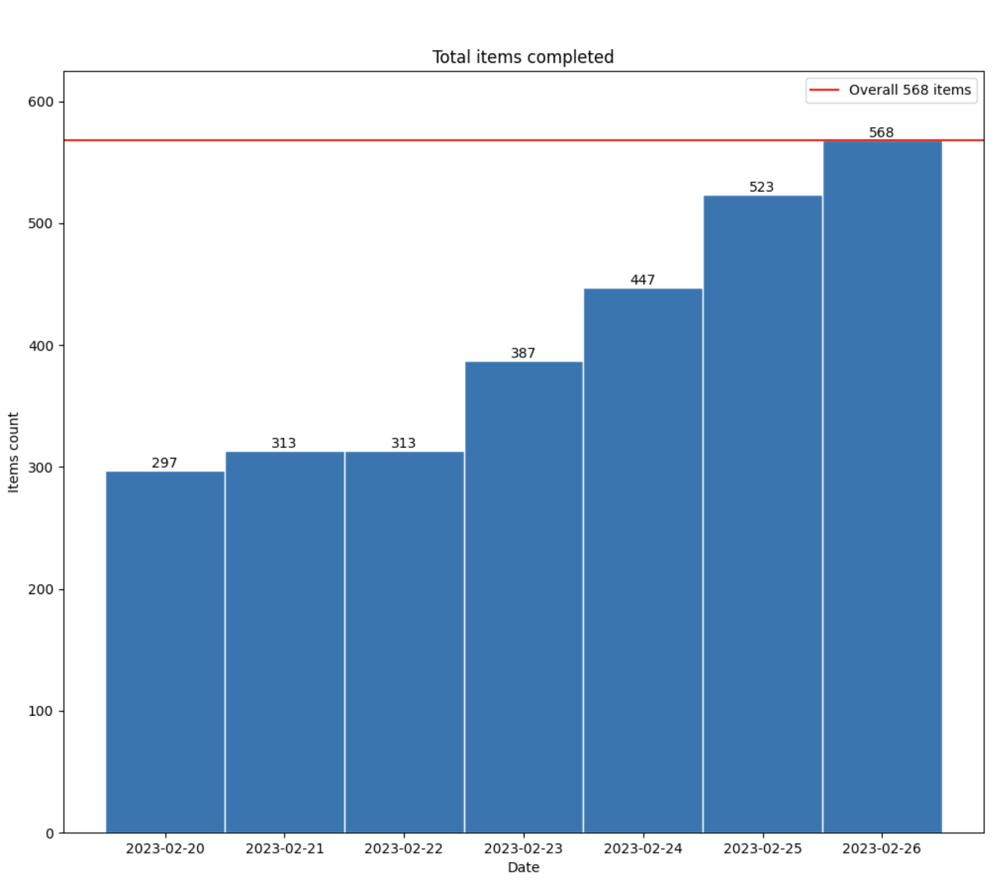
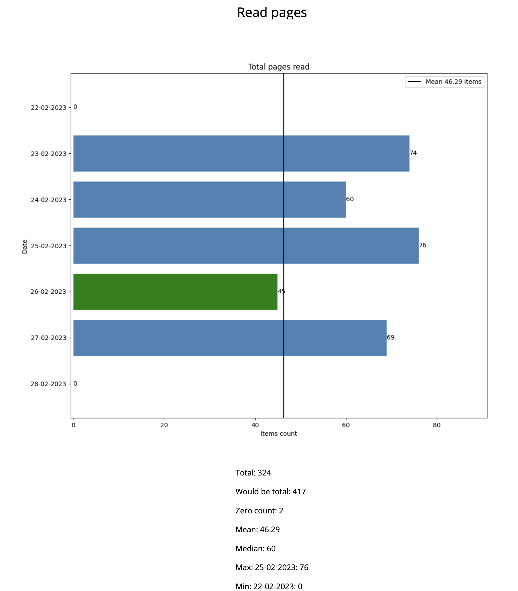

# ReadingTracker

## Content
- [What is that](#what-is-that)
- [Installation](#installation)
- [Structure](#structure)
  - [Queue](#queue)
  - [Reading](#reading)
  - [Completed](#completed)
  - [Repeat](#repeat)
  - [Reading log](#reading-log)
  - [Notes](#notes)
    - [Notes graph](#notes-graph)
    - [Note context menu](#note-context-menu)
    - [Show the note](#show-the-note)
    - [Edit the note](#edit-the-note)
  - [System](#system)
    - [Material reading graphic](#material-reading-graphic)
    - [Tracker statistics](#tracker-statistics)
    - [Read pages statistics](#read-pages-statistics)
    - [Inserted notes statistics](#inserted-notes-statistics)

## What is that?
The project is expected to help you to read books:
1. Keep a list of books you want to read;
2. Keep a list of reading and completed materials;
3. Calculate statistics;
4. Track the reading log;
5. Take notes to help you remember some important points from the material.

## Installation
1. Clone the repo: `git clone https://github.com/kunansy/ReadingTracker`.
2. Create the Google Drive service account: https://labnol.org/google-api-service-account-220404, first 4 steps.
3. Create env file and fill it: `cp env.template .env`.
4. Run docker container: `docker compose up -d --build --force-recreate`
5. Migrate the database: `docker exec -i -t reading_tracker python3 /app/tracker/main.py`

## Structure
### Queue
Here there are the books, articles, courses etc. to read with some analytics, 
the expected reading time according to the mean pages read.

## Reading
Here there are the materials you are currently reading.

## Completed
Here there are the materials that have been read.

## Repeat
Here there are the materials that have been read and need to be read again, repeated after a month or more.
The priority is equal to the number of months since the material was last read or repeated.

## Reading log
Here there is the reading log of the materials. The day is red if 
there are less than average pages, green if there are more.

## Notes
Here there are notes, the most important info from the materials. 
The user can search a note with Manticoresearch by any text query, 
filter notes by materials or tags.

You should:
* Create small notes with one idea in each note.
* Add _tags_ that helps to link some ideas into topic groups: `#health`, `#history`, `#linguistics` etc.
* Add _links_ to help connect notes together using [Zettelkasten method](https://writingcooperative.com/zettelkasten-how-one-german-scholar-was-so-freakishly-productive-997e4e0ca125).
* Each note should be linked to note that has a direct link to it: `[[c2ed0ac7-fe4f-4a23-a00c-8f61d16398ea]]`

### Notes graph
Also, here there is a graph with all notes.

### Note context menu
The user can open a note with context menu, edit it or delete.

### Show the note
Using these arrows user can iter over all note links.

Here is a graph with the current note links.

### Edit the note
When edit the note the user can:
* Use speech recognition and enter text using a voice (buttons `Start`, `Stop`);
* Choose some compatible tags (tags are sorted so that the ones used in notes for this material come first);
* Choose the link to another note: there are only notes with the same tags ordered by tags intersection.

Tags and links lists might be scrolled left/right.

## System
Here there are reading graphic, backuping and restoring from the Google Drive.

All graphic shows statistics for chosen time span (a week by default).

### Material reading graphic
How the material was being reading:

### Tracker statistics

### Read pages statistics
Statistics of read pages for the time span.

* `Would be total` — how many pages would be read if there were no empty days;
* A day when a material was completed is marked in green.

### Inserted notes statistics
Statistics of inserted notes for the time span.

